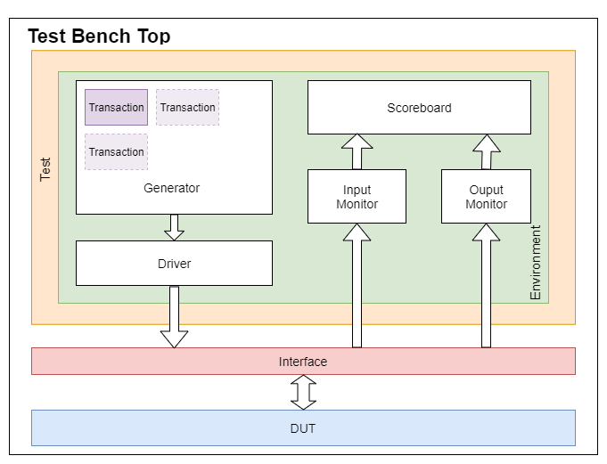

## How to run test bench

- Download the latest release from below or visit the [release page](https://github.com/kumarrishav14/AMBA_APB/releases) for more releases.
  - [Click to Download](https://github.com/kumarrishav14/ALU_UVM/archive/v1.0.zip)
- Copy the contents in a folder.
- Compile *tb_top.sv* in any simulator and simulate *top* module.

## Architecture

<figure>
    
    <figcaption><b>Fig. 1:</b> Testbench Architecture</figcaption>
</figure>

